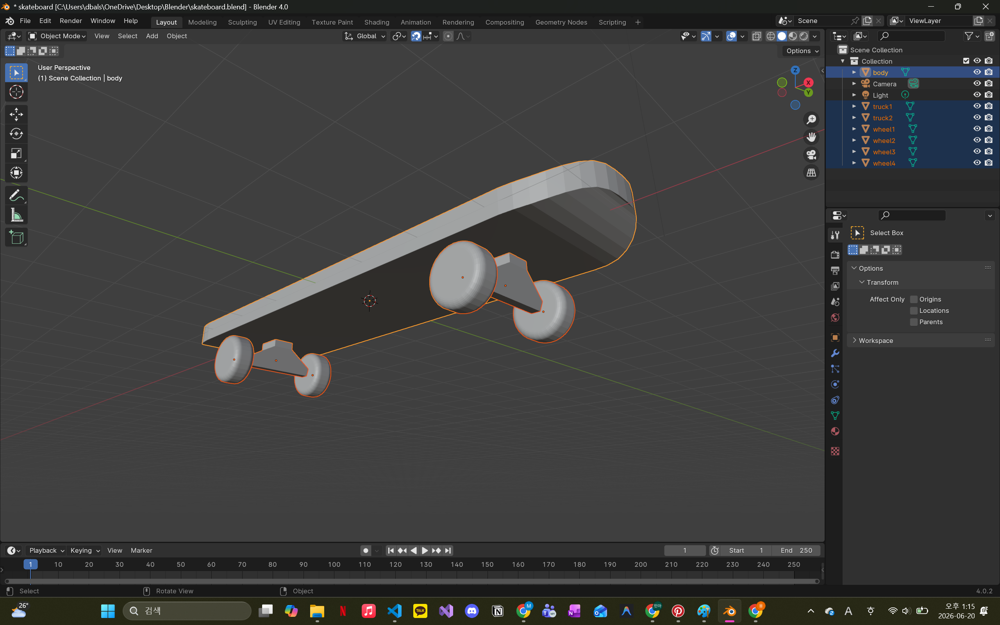

# kickgrind

🔗 [Live Demo](https://yumina0616.github.io/kickgrind/)

A 3D world made entirely of repetitive, tired words — and a skateboard that lets you smash through it.

I've recently gotten into skateboarding, and what drew me in was how dynamic and bold its movements are — never following a fixed line, always carving its own path. This project grew out of wanting to bring that same unpredictability into something tedious and repetitive: take the most clichéd, overused sentence you can think of, fill the screen with it, and let a skateboard tear an unscripted path straight through it.

Drop in whenever you need to skate over something tedious ... 🛹

## About

The screen fills with whatever text you type — repeated over and over until it covers the entire ground. A 3D skateboard, modeled by hand in Blender, drops in from above and lands on the text field. You steer it with the arrow keys, carve through the words, flip with the spacebar, and watch the letters glow and scatter as the board smashes through them.

This is my first project combining hand-built 3D assets with real-time physics and interactive web design — a step up from my first interactive web project, [I'll Cry For You](https://yumina0616.github.io/CryForU).

## Interactions

* 🛹 **Arrow keys** — steer the board, with momentum-based acceleration and smooth turning
* 🔁 **Spacebar** — kickflip; tap repeatedly mid-air to complete the rotation before landing
* 💥 **Collision physics** — ride through text at speed to knock words flying, with a free-flight burst before they drift back to place
* ✨ **Neon glow** — words pulse green and bloom on impact, fading back to idle color
* 🔊 **Dynamic audio** — rolling sound scales with speed and camera distance, with randomized jump/landing sound variations
* 🔃 **Reset icon** — drop the board back in from the sky if it ever flies off-screen or lands upside down
* 🪂 **Drop-in animation** — the board free-falls onto the field every time you start or reset

## Built With

* Three.js (custom physics, PositionalAudio, UnrealBloomPass post-processing)
* Vanilla JavaScript + Vite
* Blender (hand-modeled, low-poly skateboard, exported as .glb)
* Google Fonts

## Author

Mina Yu
CS student with a love for interactive web design.